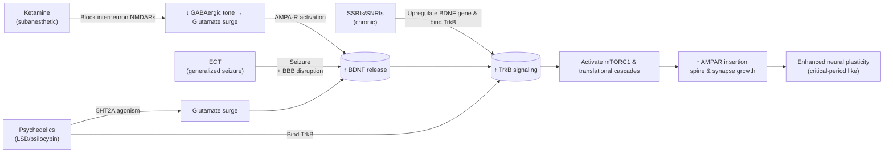

# Executive Summary  
Antidepressant treatments act via intertwined neurotrophic and network mechanisms. Traditional SSRIs/SNRIs produce **gradual BDNF/TrkB activation**: they chronically increase BDNF expression and TrkB phosphorylation, and even bind TrkB allosterically【11†L390-L398】【39†L309-L318】. By contrast, **rapid-acting agents (ketamine, ECT, psychedelics)** evoke an **acute neural perturbation** that triggers a trophic cascade. For example, ketamine’s NMDA‑blockade of interneurons causes a transient glutamate surge and AMPA‑receptor activation, driving rapid BDNF release, mTOR signaling and synaptogenesis【19†L29-L38】【42†L233-L242】. ECT induces a generalized seizure and BBB disruption, sharply elevating brain BDNF/other growth factors【15†L460-L466】. Classic psychedelics (LSD/psilocybin) combine features: they potently **bind TrkB** (positive allosteric modulation【5†L109-L115】) while also acutely exciting cortex via 5-HT2A. All these treatments ultimately converge on enhanced TrkB signaling → mTOR/AMPAR pathways → new spine/synapse growth, creating a “hyperplastic” state. Importantly, necessity experiments show that functional BDNF–TrkB signaling is required: BDNF or TrkB loss-of-function abolishes SSRI and ketamine-like effects【39†L309-L318】【42†L233-L242】. However, simply infusing BDNF is insufficient as a therapy (BDNF must be released/activity-dependent and paired with appropriate synaptic activity). Peripheral BDNF biomarkers rise in response to chronic SSRIs and ECT, but not reliably after a single ketamine or psychedelic dose【26†L281-L290】【29†L549-L558】.  

## Direct vs. Circuit-Trigger Models  
**Evidence for direct BDNF-TrkB activation:** Recent work shows diverse antidepressants can **allosterically potentiate TrkB**. Casarotto *et al.* found SSRIs, ketamine, etc., bind a transmembrane pocket on TrkB, increasing its synaptic localization and BDNF responsiveness【11†L390-L398】. Saarelainen *et al.* demonstrated fluoxetine/imipramine acutely phosphorylate TrkB in cortex, and that mice with reduced TrkB signaling or BDNF deficiency fail to respond to SSRIs【39†L309-L318】. Moliner *et al.* (2023) reported LSD/psilocin bind TrkB with ~1000× higher affinity than SSRIs, and that psychedelic-induced spine growth and antidepressant-like behavior strictly require this TrkB binding【5†L109-L115】. Thus psychedelics seem to act as high-affinity TrkB modulators. These findings support a **“permissive” model**: drugs directly augment BDNF-TrkB signaling, priming synapses for plasticity.  

**Evidence for acute-trigger (homeostatic) pathway:** In contrast, ketamine and ECT fit a model where **initial hyperexcitation** provokes a compensatory plasticity surge. Ketamine’s blockade of NMDA receptors on inhibitory interneurons yields a transient glutamate “burst” and AMPAR stimulation【19†L29-L38】. This glutamate/AMPAR drive triggers massive BDNF release from pyramidal cells and activation of downstream mTORC1 and protein synthesis【19†L31-L39】【42†L233-L242】. Lepack *et al.* showed that neutralizing BDNF in mPFC or genetic loss of activity-dependent BDNF release (Val66Met) abolishes ketamine’s antidepressant effect【42†L233-L242】. These data argue ketamine works by an **activity-dependent BDNF surge**, not merely by direct receptor binding. ECT similarly imposes a generalized seizure: intracranial EEG shows massive desynchronization and glutamate release, followed by increased neurotrophin expression【15†L460-L466】. Indeed ECT reliably elevates blood BDNF after a course of treatments【31†L103-L111】【34†L320-L329】. Psychedelics also acutely depolarize cortex via 5-HT2A; a recent study found psilocybin causes widespread cortical spiking and selective rewiring of inputs, and that silencing this activity blocks the synaptic remodeling【48†L343-L352】【48†L353-L356】. This supports an **“activity gating”** model: the acute perturbation (via glutamate or neuromodulation) initiates spine growth in a context-dependent way.  

In summary, *both* models have support. SSRIs and psychedelics clearly engage TrkB more directly, while ketamine and ECT appear to rely on an acute glutamatergic trigger that secondarily upregulates BDNF signaling. The likely reality is an integration: many treatments do both. High-affinity TrkB modulators (psychedelics) may even obviate the need for massive glutamate bursts, whereas milder modulators (SSRIs, ketamine) depend on an upstream excitatory event to fully unleash plasticity.  

## Comparative Summary of Treatment Modalities  

| Modality                    | BDNF/TrkB Effects                              | mTOR/AMPAR signaling          | Timing of Plasticity                       | Circuit/E/I Effects                                    | Knockout/Blockade Findings                                         | Peripheral BDNF Biomarker         |
|-----------------------------|-----------------------------------------------|-------------------------------|--------------------------------------------|-------------------------------------------------------|--------------------------------------------------------------------|------------------------------------|
| **SSRIs/SNRIs (fluoxetine, venlafaxine, etc.)**  | ↑ BDNF expression (weeks)【22†L13-L20】; acute TrkB phosphorylation【39†L309-L318】; bind TrkB (micromolar affinity)【11†L390-L398】 | ↑ mTOR-ERK/CREB signaling (delayed); increased AMPAR insertion (chronic)【22†L13-L20】 | **Slow:** clinical effects ~2–6 weeks【39†L323-L329】【26†L281-L290】 | Chronic treatment **reduces PV interneuron markers/PNNs**, lowering inhibition and reopening critical-period plasticity【24†L49-L57】; no acute glutamate surge | BDNF or TrkB loss (t1 overexpression) abolishes SSRI behavioral effects【39†L309-L318】; TrkB antagonists block chronic SSRI-induced spine growth | ↑ Serum/CSF BDNF after weeks of treatment (sertraline especially)【26†L281-L290】 |
| **ECT (bipolar or unilateral)**       | No direct TrkB binding known; induces robust **BDNF release** in brain (via seizure/BBB effects)【15†L460-L466】; chronic ↑ BDNF mRNA/protein | Broad increase in neurotrophic signaling (BDNF, FGF, VEGF); upregulated synaptic markers post-ECT | **Intermediate:** several sessions over 1–3 weeks needed for maximal response【31†L103-L111】【34†L320-L329】 | **Generalized seizure:** massive cortical desynchronization and glutamate surge; transient BBB opening leads to neurotrophin release【15†L460-L466】 | No direct TrkB KO data; blockade of initial seizure is inhibitory. Increased BDNF after ECT is **not correlated with clinical outcome**【31†L103-L111】. | ↑ Plasma/serum BDNF after ECT course (meta: Hedges’ g ≈0.28)【31†L103-L111】【34†L320-L329】; no clear link to symptom remission |
| **Ketamine (IV 0.5 mg/kg)**     | Binds TrkB (low affinity, μM)【5†L109-L115】; **induces acute BDNF release**【42†L233-L242】 | Rapid activation of mTORC1 and synaptic protein synthesis【19†L31-L39】; enhanced AMPAR throughput | **Fast:** antidepressant effects within hours; synaptic effects seen within 1–24h【19†L31-L39】【16†L169-L175】 | **NMDA blockade of interneurons:** disinhibition of pyramidal cells, causing glutamate “burst”【19†L31-L39】; increased E/I balance (↑γ power) | BDNF release blockade (antibody) or BDNF Val66Met/KO abolish ketamine’s effects【42†L233-L242】; AMPAR antagonists (NBQX) block its synaptogenesis【19†L61-L64】 | Meta-analyses find **no consistent acute rise in plasma BDNF** post-ketamine【29†L549-L558】【19†L72-L75】, though longer-term responder vs non-responder differences have been reported【29†L571-L580】. |
| **Classic Psychedelics (LSD, psilocybin)** | **Direct high-affinity TrkB modulation:** LSD/psilocin bind TrkB (Kd∼nM)【5†L109-L115】; rapidly ↑ BDNF/TrkB signaling (in animals) | mTOR signaling increased in PFC (hours–days); AMPAR/TrkB-dependent spine growth | **Fast:** single dose causes cortical plasticity within hours (lasting days/weeks)【5†L109-L115】【48†L343-L352】 | **5-HT2A agonism:** acute glutamate elevation and cortical desynchronization; increased network entropy. Recent data: psilocybin causes broad cortical spiking and network-specific spine rewiring【48†L343-L352】【48†L353-L356】 | Genetic or pharmacologic interruption of TrkB blocks psychedelic-induced plasticity; **5-HT2A blockade does NOT block** spine growth (Moliner *et al.*)【5†L109-L115】. (In contrast, silencing cortical activity *does* block rewiring【48†L353-L356】.) | Controlled studies show **no reliable acute increase** in serum BDNF after a single psychedelic dose【29†L549-L558】. Long-term studies are lacking; peripheral BDNF may not reflect rapid cortical changes. |

**Figure:** *Mechanistic flowchart of antidepressant/neuroplasticity pathways.* Both chronic monoaminergic antidepressants (SSRIs/SNRIs) and psychedelics can directly potentiate TrkB signaling (via allosteric binding or gene induction), whereas ketamine and ECT produce an **acute circuit disruption** (glutamate surge/seizure) that drives BDNF release. These processes converge: elevated BDNF/TrkB activation and mTOR‑AMPAR cascades promote synaptogenesis and a transient “hyperplastic” state. The figure highlights drug-specific inputs (left) and common intracellular effectors (right), schematizing how treatments ultimately enable experience-dependent network reconfiguration.  

**Key References:** Recent studies underpinning these conclusions include Casarotto *et al.* (2021) demonstrating direct TrkB binding by SSRIs/ketamine【11†L390-L398】; Moliner *et al.* (2023) showing LSD/psilocin as high-affinity TrkB modulators【5†L109-L115】; Saarelainen *et al.* (2003) proving that TrkB activation is required for SSRI action【39†L309-L318】; Lepack *et al.* (2015) showing ketamine’s effects require activity-dependent BDNF release【42†L233-L242】; and large reviews/meta-analyses of ketamine mechanisms【19†L31-L39】, ECT effects【31†L103-L111】【34†L320-L329】, and antidepressants’ effects on BDNF【26†L281-L290】. These primary sources and recent reviews (cited above) provide detailed evidence for each pathway.  

